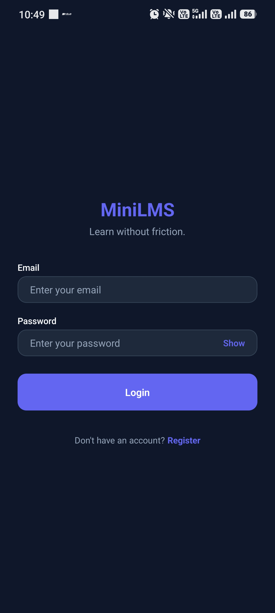
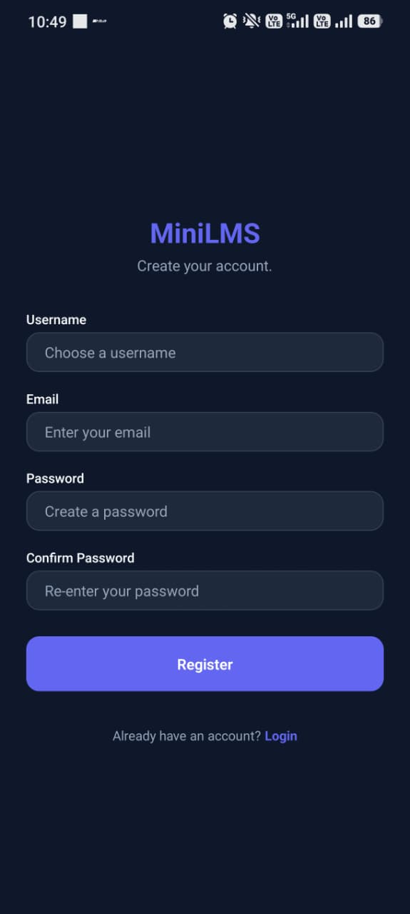
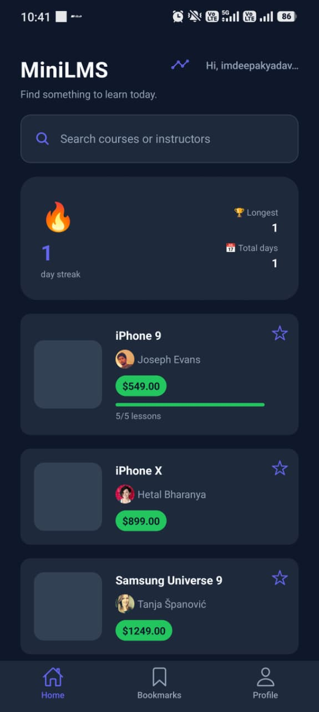
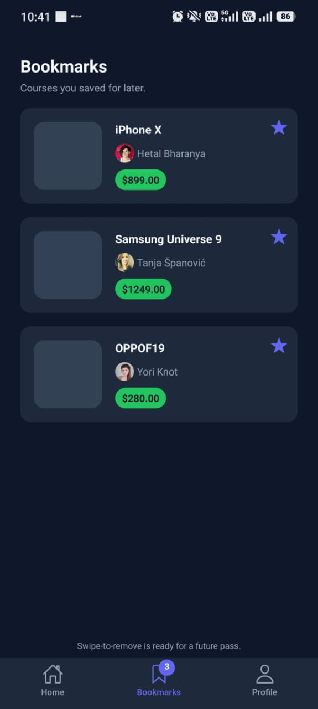
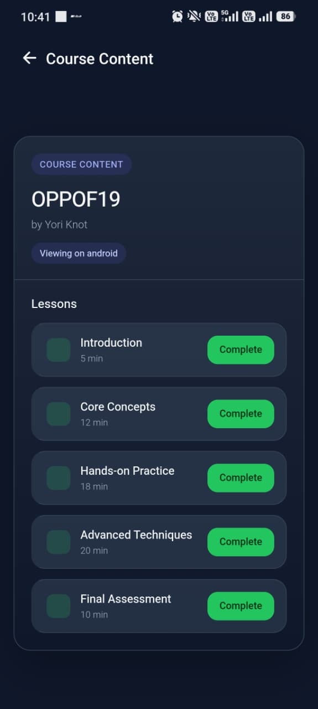
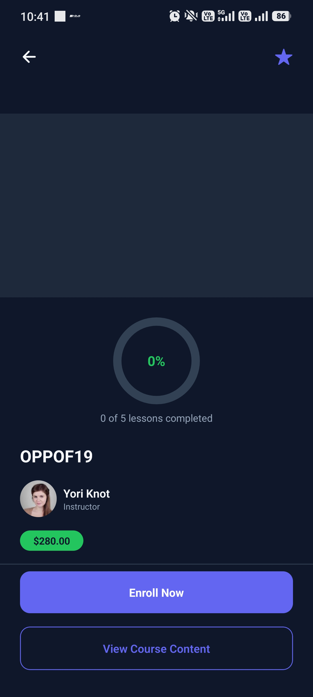
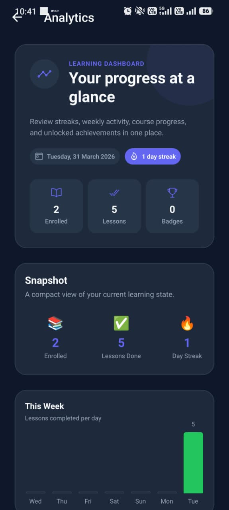
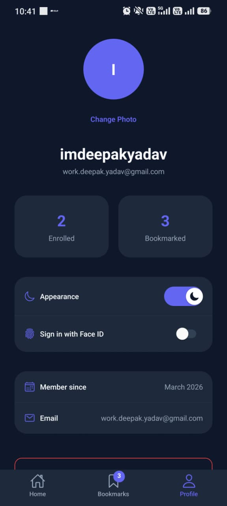

# MiniLMS

MiniLMS is a production-style mobile learning management system built with React Native and Expo. It was designed as an assignment submission, but the implementation goes beyond a demo: the app includes authentication, local persistence, lesson-level progress tracking, a WebView-based course experience, offline awareness, local notifications, dark/light mode, biometric login, a streak system, and a learning analytics dashboard.

The codebase follows a feature-based architecture, uses TypeScript in strict mode, and keeps sensitive data in secure storage while leaving non-sensitive app state in AsyncStorage. The result is a realistic Expo application that demonstrates both product thinking and engineering discipline.

## App Overview

MiniLMS is a compact learning platform for browsing courses, saving bookmarks, opening course detail pages, and completing lessons inside a WebView-backed learning experience. Every completed lesson updates local progress state, which then feeds the course detail screen, the home screen streak card, and the analytics dashboard.

The app is intentionally built around real mobile product concerns rather than only UI screens. It handles session persistence, token refresh, biometric access where available, offline detection, notification permissions, and safe rehydration of local data on launch. The UI is fully theme-aware and supports both light and dark mode.

## Key Features

### Core Learning Features

- Authentication flow with login, register, session persistence, auto-login, and logout.
- Course catalog with search and bookmark support.
- Course detail screen with enrollment state, lesson progress, and completion tracking.
- WebView-based lesson viewer with two-way native and web communication.
- Local progress persistence so the app remembers what the learner has completed.

### Engagement and Retention Features

- Daily learning streak tracking stored locally on device.
- Milestone badges for 3, 7, 14, and 30 day streaks.
- Learning analytics dashboard with weekly activity, course progress, and summary statistics.
- Streak reminder and re-engagement notifications.
- Badge unlock notifications and course completion notifications.

### Security and Device Features

- SecureStore-backed auth token storage.
- Biometric login using Face ID or fingerprint where supported.
- Profile photo selection with Expo Image Picker.
- Offline detection and graceful UI feedback when network access is unavailable.

### Product Polish

- Dark and light themes with persistent manual switching.
- Safe-area aware layouts across the app.
- Shared design tokens for spacing, radius, typography, and color.
- Consistent UI primitives for cards, buttons, empty states, loaders, and error states.

## Tech Stack

| Category       | Technology                      | Why it is used                                            |
| -------------- | ------------------------------- | --------------------------------------------------------- |
| Framework      | React Native + Expo             | Managed workflow, fast iteration, and device APIs         |
| Navigation     | Expo Router                     | File-based routing that matches the app structure         |
| Language       | TypeScript                      | Strong typing across screens, services, and local state   |
| HTTP           | Axios                           | Request interceptors, refresh-token handling, retry logic |
| Storage        | AsyncStorage                    | Non-sensitive persistence such as bookmarks and progress  |
| Secure Storage | Expo SecureStore                | Encrypted storage for auth tokens                         |
| WebView        | react-native-webview            | Embedded course lesson experience with JS bridge support  |
| Notifications  | expo-notifications              | Local notifications and scheduling                        |
| Biometrics     | expo-local-authentication       | Face ID and fingerprint login support                     |
| Media          | expo-image-picker               | Profile image selection                                   |
| Lists          | @legendapp/list                 | Efficient course list rendering                           |
| Connectivity   | @react-native-community/netinfo | Offline state monitoring                                  |
| SVG            | react-native-svg                | Progress ring and visual indicators                       |
| Icons          | @expo/vector-icons              | Consistent iconography across the UI                      |

## Project Structure

```text
app/
  _layout.tsx                Root provider tree and app shell
  (auth)/                    Authentication flow
    _layout.tsx
    login.tsx
    register.tsx
  (tabs)/                    Main application tabs
    _layout.tsx
    index.tsx
    bookmarks.tsx
    profile.tsx
  analytics.tsx              Learning analytics dashboard
  course/[id].tsx            Course detail screen
  webview/[id].tsx           Lesson viewer and completion bridge

components/
  ui/                        Shared UI primitives
  course/                    Course-specific cards and controls
  analytics/                 Analytics widgets and summaries
  streak/                    Streak card and achievement grid

features/
  auth/                      Auth service, hook, and biometric support
  courses/                   Course fetching and bookmark logic
  streak/                    Streak persistence and badge awarding
  notifications/             Notification scheduling and bootstrap

store/
  authStore.tsx              Global auth state
  courseStore.tsx            Course, bookmark, and progress state
  themeStore.tsx             Light/dark theme state

services/
  api.ts                     Axios client and interceptors
  storage.ts                 AsyncStorage helpers
  secureStorage.ts           SecureStore helpers

hooks/
  useDebounce.ts             Search input debounce helper
  useNetworkStatus.ts        Connectivity state hook

types/
  auth.types.ts
  course.types.ts
  api.types.ts

utils/
  constants.ts               API base URL and storage keys
  theme.ts                   Tokens for colors, spacing, typography
  helpers.ts
```

## Setup Instructions

### Prerequisites

- Node.js 18 or newer.
- npm 9 or newer.
- Expo CLI available through `npx`.
- EAS CLI if you plan to create release builds.
- A physical iOS or Android device for biometrics and notifications.

### Install Dependencies

```bash
npm install
```

### Run the App

```bash
npx expo start
```

Then scan the QR code with Expo Go on a physical device, or launch the app in a simulator/emulator if your platform supports the feature you are testing.

### Platform Targets

```bash
npm run android
npm run ios
npm run web
```

The `web` target is useful for quick UI checks, but native features such as biometrics, local notifications, and some device-specific flows require a real mobile device.

## Configuration

The app uses a fixed API base URL defined in `utils/constants.ts`, pointing to the Free API service used by the assignment. No separate `.env` file is required for the current codebase.

If you need to change the backend endpoint, update `API_BASE_URL` in `utils/constants.ts` and rebuild the app.

## Build Instructions

### Android Development Build

```bash
npx expo run:android
```

### iOS Development Build

```bash
npx expo run:ios
```

### EAS Preview Build

```bash
npm install -g eas-cli
eas login
eas build:configure
eas build --platform android --profile preview
```

### Release Output

For Android release builds, the generated APK or AAB will be produced through EAS or the local Expo build pipeline depending on the profile you choose.

## Scripts

| Script           | Command           | Purpose                                |
| ---------------- | ----------------- | -------------------------------------- |
| Start dev server | `npm run start`   | Launch Expo with QR code and dev tools |
| Android          | `npm run android` | Open the app on Android                |
| iOS              | `npm run ios`     | Open the app on iOS                    |
| Web              | `npm run web`     | Open the app in a browser              |

## Architectural Decisions

### Feature-Based Structure

The codebase is organized by feature rather than by technical layer alone. Authentication, courses, streaks, notifications, and analytics each have their own service and state files. This keeps the app scalable and makes each feature easier to reason about during review.

### Token-Driven Styling

The app uses a custom theme token system in `utils/theme.ts` instead of a utility-class styling library. This provides strong TypeScript support for spacing, radius, typography, and color tokens, while keeping styling explicit and easy to audit.

### Context and Reducers for Global State

React Context with `useReducer` is used for app-wide state such as authentication, courses, and theme mode. At this scale, that is a deliberate tradeoff: it keeps the dependency surface small and avoids introducing a heavier state library when the requirements do not need one.

### Secure Storage Separation

Only auth credentials live in SecureStore. Progress, bookmarks, streaks, badges, and theme preferences are stored separately in AsyncStorage. This follows a least-privilege approach and keeps sensitive data isolated from general app data.

### WebView Communication Model

The lesson experience uses both transport headers and a JavaScript bridge. Headers provide request metadata, while `injectJavaScript` and `postMessage` handle lesson rendering and completion events. That split is intentional because `react-native-webview` does not expose all request headers to in-page JavaScript.

### Manual Retry Logic

The API layer uses manual retry behavior instead of a third-party retry package. That makes the network behavior easier to inspect during grading and gives full control over refresh-token recovery, retries, and auth failure handling.

### Learning Streak Design

The streak system compares date strings rather than raw timestamps to avoid timezone-related bugs. Activity updates are guarded so the streak is not incremented repeatedly during the same render cycle or app session.

### Analytics Without a Chart Library

The weekly activity chart is built with React Native primitives and Animated APIs. That keeps the dependency footprint smaller and demonstrates direct control over the native UI layer.

## Data Flow

### Authentication

1. User logs in or registers.
2. Access and refresh tokens are saved in SecureStore.
3. The auth store rehydrates the session on app launch.
4. Axios attaches the bearer token to requests and refreshes it on 401 responses.

### Course Progress

1. Course content is opened from the catalog or detail screen.
2. Lesson completion is sent from the WebView to native code.
3. The course store updates local enrollment and progress state.
4. The analytics dashboard and progress ring reflect the new state immediately.

### Streaks and Badges

1. Each qualifying learning action records activity locally.
2. The streak data updates using date-based logic.
3. Badge thresholds are checked after the streak update.
4. Unlocks trigger notifications and update the analytics dashboard.

## Known Limitations

- Course data is sourced from public APIs and combined into a simulated LMS experience rather than a real backend-managed catalog.
- The lesson content inside the WebView is local HTML and mock content, not a real LMS content service.
- Local notifications require a physical device for realistic testing.
- Biometrics only appear when the device supports and has enrolled biometric authentication.
- Profile photos are stored locally as device URIs and are not uploaded to a server.

## Screenshots

<table>
  <tr>
    <td align="center"><strong>Login</strong><br /></td>
    <td align="center"><strong>Register</strong><br /></td>
    <td align="center"><strong>Home</strong><br /></td>
  </tr>
  <tr>
    <td align="center"><strong>Bookmarks</strong><br /></td>
    <td align="center"><strong>Course Detail</strong><br /></td>
    <td align="center"><strong>Course Content</strong><br /></td>
  </tr>
  <tr>
    <td align="center"><strong>Analytics</strong><br /></td>
    <td align="center"><strong>Profile</strong><br /></td>
    <td align="center"></td>
  </tr>
</table>

The screenshots above capture the main user journey across authentication, browsing, learning, progress tracking, and profile settings.

## Submission Notes

This app was built as a React Native Expo assignment submission, but the implementation is structured like a small production product. Evaluators should be able to review the repository and see clean separation of concerns, secure token handling, typed local state, and a mobile-first approach to retention and analytics features.

## Documentation

- [Setup](SETUP.md) for local installation, environment details, and build commands.
- [Instructions](INSTRUCTIONS.md) for evaluating and using the app.
- [Contributing](CONTRIBUTING.md) for development and pull request guidance.
- [Security](SECURITY.md) for reporting vulnerabilities and handling sensitive data.
- [Changelog](CHANGELOG.md) for release history and notable changes.
- [License](LICENSE) for the project license terms.

## Author

Deepak Yadav

## License

This project is submitted for academic evaluation and is not intended for commercial redistribution.
